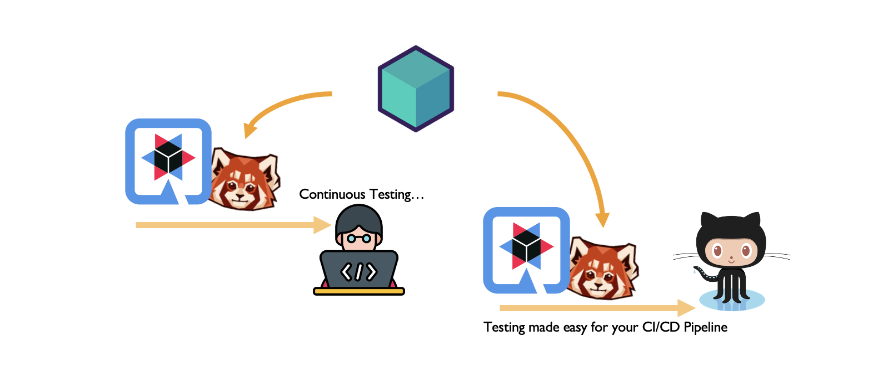
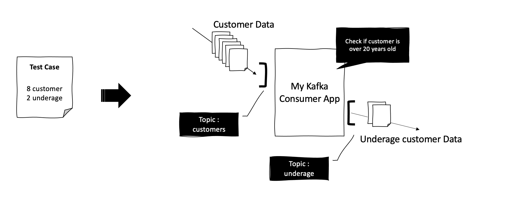
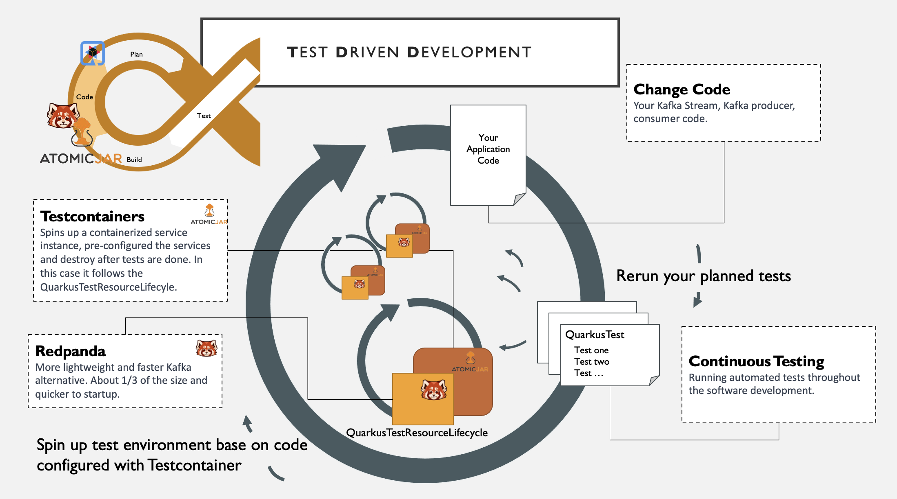
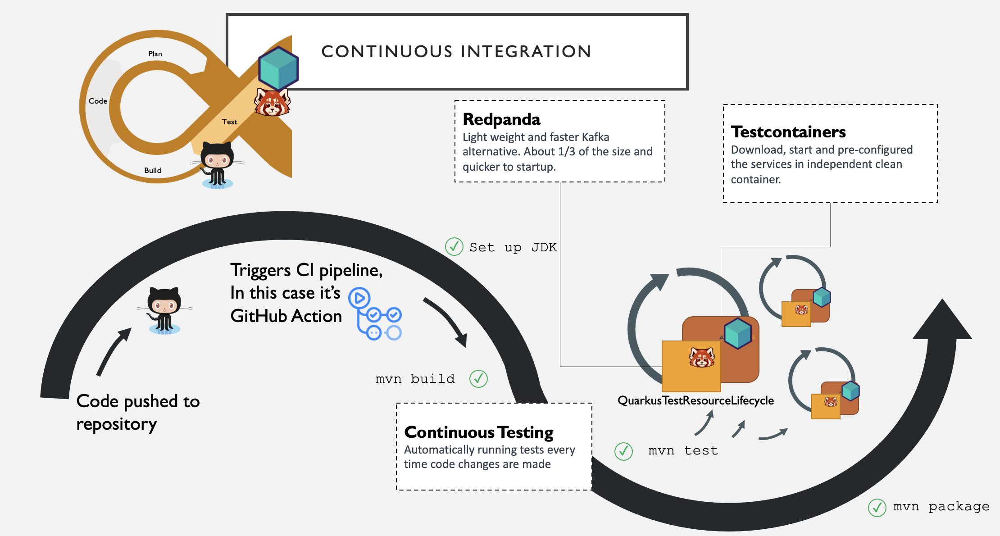

# Test Driven Development and CI testing for Kafka Developers
## Quarkus, Testcontainers, Redpanda and Github Actions



This demo was created with the TDD approach. 

- Define the desire behavior in a test
- Using TestContainer to configure the Redpanda
- Write the application and run test to verify if it has the expected result

And once it’s done both test and application code are committed to the repo, and the continuous integration pipeline will rerun the test to make sure the code changes do not break existing functionality or introduce new bugs. 


This project uses: 
- [Quarkus](https://quarkus.io/) as base Java framework.
- [Redpanda](https://redpanda.com/) as the data streaming platform(Kafka).
- [TestContainer](https://www.atomicjar.com/) as the testing framework.
- [Github Action](https://github.com/features/actions) as the CI workflow.


## Demo scenario
It’s a simple application to name the underage customers. All customer information is streamed into the “customer” topic, the application will simply filter the underage customer list into a special topic “underage”. 



The test planned was also also pretty straight-forward. We have 8 fixed customer streamed:
ID | Name | Age
----|--------|----
101 | Abby | 17
202 | Brooke | 42
303 | Crystal | 31
404 | Diana | 51
505 | Ellis | 16
606 | Fiona | 22
707 | Gabby | 33
808 | Hannah | 29

And we will be expecting to see 2 underage customers in the underage topic
        
```
        Producer<Integer, Customer> producer = createCustomerProducer("customers");
        ..... 
             
        producer.send(new ProducerRecord<>("customers", 101, new Customer(101, "Abby", 17)));
        producer.send(new ProducerRecord<>("customers", 102, new Customer(202, "Brooke", 42)));
        producer.send(new ProducerRecord<>("customers", 103, new Customer(303, "Crystal", 31)));
        producer.send(new ProducerRecord<>("customers", 104, new Customer(404, "Diana", 51)));
        producer.send(new ProducerRecord<>("customers", 101, new Customer(505, "Ellis", 16)));
        producer.send(new ProducerRecord<>("customers", 102, new Customer(606, "Fiona", 22)));
        producer.send(new ProducerRecord<>("customers", 103, new Customer(707, "Gabby", 33)));
        producer.send(new ProducerRecord<>("customers", 104, new Customer(808, "Hannah", 29)));
        
        ....

        Consumer<Integer, Customer> underage_consumer = createConsumer("underage");
        List<ConsumerRecord<Integer, Customer>> underage_records = poll(underage_consumer, 2);
        
        ...
        
        assertEquals(2, underage_records.size());
```

## Setting up Redpanda in Testcontainers 

To set up Redpanda as your in your test folder, create a new class that implements `QuarkusTestResourceLifecycleManager` and create a Testcontainer that will load the Redpanda broker. 

By default, Redpand will allocate a fixed amount of CPU core and memory, which is ideal for production but for development and CI environment with limited hardware capacity, we will need to assign 1 core CPU adding `overprovisioning` indicator to accommodate container resource limitations.

```
    private static DockerImageName REDPANDA_IMAGE = DockerImageName
            .parse("docker.redpanda.com/vectorized/redpanda:latest");

    @Container
    private static final RedpandaContainer redpanda = new RedpandaContainer(REDPANDA_IMAGE) {
        protected void containerIsStarting(InspectContainerResponse containerInfo) {
            String command = "#!/bin/bash\n";
            command = command
                    + "/usr/bin/rpk redpanda start --mode dev-container --overprovisioned --smp=1 --memory=2G ";
            command = command + "--kafka-addr PLAINTEXT://0.0.0.0:29092,OUTSIDE://0.0.0.0:9092 ";
            command = command + "--advertise-kafka-addr PLAINTEXT://127.0.0.1:29092,OUTSIDE://" + this.getHost() + ":"
                    + this.getMappedPort(9092);
            this.copyFileToContainer(Transferable.of(command, 511), "/testcontainers_start.sh");
        }
    }.withCreateContainerCmdModifier(cmd -> {
        cmd.getHostConfig()
                .withCpuCount(2l);
    })
            .withEnv("redpanda.auto_create_topics_enabled", "true")
            .withEnv("group_initial_rebalance_delay", "true");
```

## Running the application 


You can run your application in dev mode that enables live coding using:

```
mvn quarkus:dev
```
While you are in the DEV mode, type r to re-run test, and type o to toggle the test logs. 


## Add test to your CI pipeline


There is not much you need to do, simply add the one more step in the Github Action

```
- name: Test 
      run: mvn test
```

## Video:
Here is a quick video showing how TDD works with Quarkus, Redpanda and Testcontainers and see the demo in action.